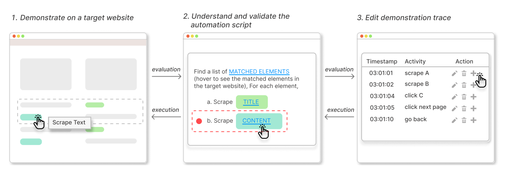
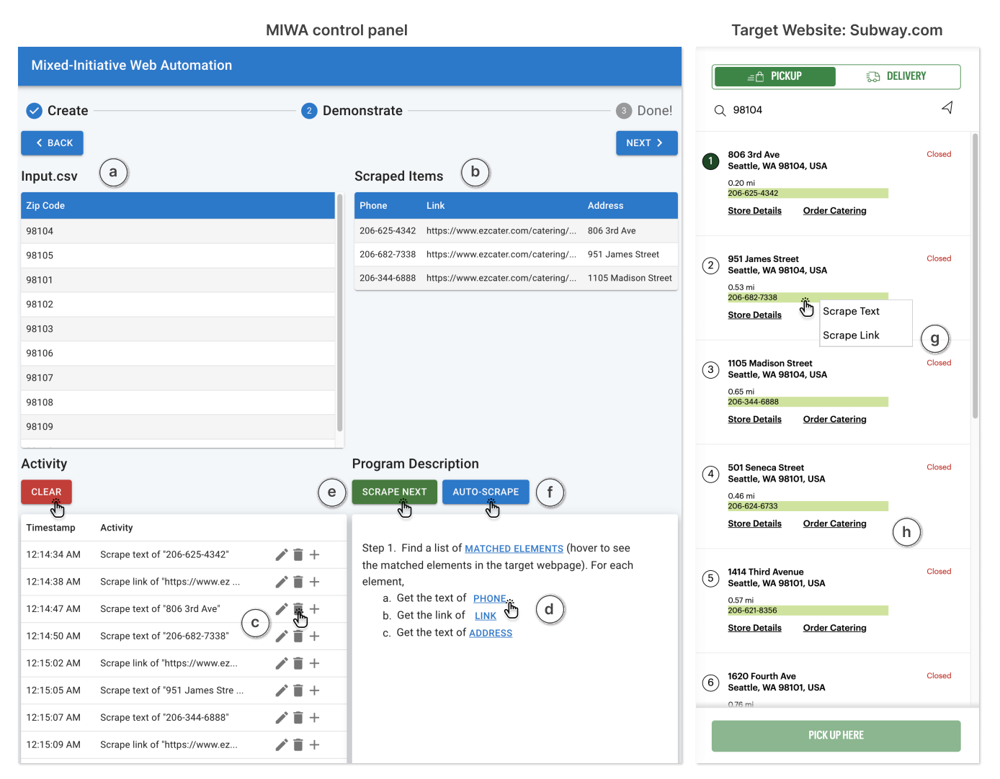

## MIWA
This is the official implementation for our paper [MIWA: Mixed-Initiative Web Automation for Better User Control and Confidence](https://tianyi-zhang.github.io/files/uist2023-miwa.pdf), UIST 2023.



### Abstract
In the era of Big Data, web automation is frequently used by data scientists, domain experts, and programmers to complete time-consuming data collection tasks. However, developing web automation scripts requires familiarity with a programming language and HTML, which remains a key learning barrier for non-expert users. We provide MIWA, a mixed-initiative web automation system that enables users to create web automation scripts by demonstrating what content they want from the targeted websites. Compared to existing web automation tools, MIWA helps users better understand a generated script and build trust in it by (1) providing a step-by-step explanation of the script’s behavior with visual correspondence to
the target website, (2) supporting greater autonomy and control over web automation via step-through debugging and fine-grained demonstration refinement, and (3) automatically detecting potential corner cases that are handled improperly by the generated script. We conducted a within-subjects user study with 24 participants and compared MIWA with Rousillon, a state-of-the-art web automation tool. Results showed that, compared to Rousillon, MIWA reduced the task completion time by half while helping participants gain more confidence in the generated script.


### Interface



### Files Path
```shell
├── back_end
│   ├── README.md
│   ├── lib
│   ├── node_modules
│   ├── package-lock.json
│   ├── package.json
│   ├── server.js
│   ├── server.js.map
│   ├── server.ts
│   ├── tsconfig.json
│   └── yarn.lock
├── front_end
│   ├── bootstrap-5.0.1-dist
│   ├── css
│   ├── manifest.json
│   ├── node_modules
│   ├── package-lock.json
│   ├── package.json
│   ├── pages
│   ├── readme.md
│   ├── resources
│   ├── scripts
│   └── test.json
└── react_web
    ├── README.md
    ├── build.sh
    ├── node_modules
    ├── package-lock.json
    ├── package.json
    ├── public
    ├── src
    └── yarn.lock
```
### Installation
MIWA consists of 3 parts: React UI, Backend System, and Chrome Extension. <br>

 <br>

You will need to install/run these three parts. <br>
- Chrome Extension

1. Make sure the chrome browser has set to the developer mode in extension page.
2. Load the extension and select the whole folder named "front_end".

Note: No compilation is needed in this part.

- React UI
```shell
cd react_web
./build.sh // this will install the required libraries and start the react ui server.
```
- Backend synthesizer
```shell
cd back_end
yarn build
yarn start // this will start the backend server
```
After installation, you will need to launch the backend synthesizer and React UI. Then, open the target page and place it next to the React UI. Finally, launch the browser extension, click "start", and scrape the target elements on the page. The browser extension will begin monitoring the actions.

### Credits
The project was developed under the supervision of Prof. [Tianyi Zhang](https://tianyi-zhang.github.io/) at Purdue and Prof. [Xinyu Wang](https://web.eecs.umich.edu/~xwangsd/) at UMich.
### Citation
If you find our work helpful, please cite:
```bibtex
@inproceedings{chen2023miwa,
  title={MIWA: Mixed-Initiative Web Automation for Better User Control and Confidence},
  author={Nguyen, Tai and Di, Yifeng and Lee, Joohan and Chen, Muhao and Zhang, Tianyi},
  booktitle={Proceedings of the 36th Annual ACM Symposium on User Interface Software and Technology},
  year={2023},
  organization={ACM}
}
